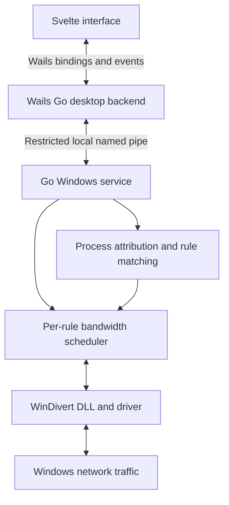

# SpeedLimitFree — Implementation Plan

Status: Windows application 0.3.0 includes the compact table, system appearance, executable icons, tray, and NSIS installer. Go, browser, native process-only, and isolated installer lifecycle checks pass. Clean-machine elevated installation/removal and traffic qualification remain; see [docs/VALIDATION.md](docs/VALIDATION.md).

## Product goal

Build a Windows desktop utility that monitors network usage and applies independent download and upload limits to selected applications or running processes.

Example: Steam shares a 5 MB/s download budget across its matching processes and connections, Chrome shares a 2 MB/s budget, and other applications remain unlimited.

The interface must stay responsive without materially increasing the traffic engine's CPU usage, memory usage, or packet latency.

## Agreed stack and initial scope

| Component | Choice |
| --- | --- |
| Desktop framework | Wails |
| Frontend | Svelte + TypeScript |
| Styling | Plain CSS with shared design tokens |
| Traffic engine and application logic | Go |
| Background runtime | Separate Go Windows service |
| Initial packet integration | WinDivert, subject to prototype validation |
| Desktop-to-service communication | Access-restricted local Windows named pipe |
| Rule persistence | Versioned JSON, validated and written atomically by the service |
| Initial platform | Windows 11 x64 |

Use a client-side Svelte frontend; this utility does not need server-side rendering or SvelteKit. Pin compatible Go, Wails, Svelte, and WinDivert versions when scaffolding, after checking their supported releases. Include WebView2 runtime detection in packaging.

Windows 11 x64 is a planning assumption based on the current development environment. Additional operating systems and architectures require separate traffic-control backends and validation.

## Architecture



### Desktop responsibilities

- Display processes, current rates, saved rules, and service status.
- Submit validated user commands through the Go desktop backend.
- Receive aggregated statistics rather than packet events.
- Show whether a rule is pending, applied, disabled, or failed.
- Allow the UI to exit while the service continues enforcing rules.
- Closing the window hides it to a native Windows tray icon; the tray provides Open, Pause/Resume, and explicit Quit. A second launch restores the existing window.

### Service responsibilities

- Own packet handles, process tracking, rule matching, scheduling, and persistence.
- Enforce limits independently of the UI lifecycle.
- Publish bounded telemetry snapshots without blocking packet processing.
- Validate every command, including limits and rule scope.
- Restrict named-pipe clients to the authorized local user and administrators; reject remote access. Initially support one owning user rather than a multi-user policy system.
- Run with the privileges required by the driver. Keep the WebView and desktop process unelevated.

### Packet integration

Go can call Windows APIs and the WinDivert DLL, but Go alone does not provide arbitrary process traffic interception.

WinDivert's network layer supplies packets without process IDs. Correlate those packets with process-aware flow/socket events using protocol, local/remote addresses, ports, and additional interface context where needed. Track process creation time to guard against PID reuse.

Open event observation before network interception and seed existing connection ownership from Windows connection tables where possible. Existing UDP attribution, shared endpoints, event ordering, IPv6, and rapid connection churn need explicit prototype tests. Never guess ownership when attribution is ambiguous: pass the traffic through and record the limitation in diagnostics.

Initially support ordinary TCP and UDP traffic. Validate QUIC behavior as part of UDP support. Exclude loopback from limiting by default. Define handling for fragments and unsupported traffic explicitly before release; pass unsupported packets through rather than silently blocking them.

Use WinDivert behind an internal interface so the backend can be replaced if measurements show unacceptable attribution or performance limits. A custom Windows Filtering Platform driver is a later engineering decision, not part of the initial build.

## Rule behavior

### Rule scopes

- **Application rule:** persisted against a normalized executable path; applies to matching running processes and future instances.
- **Process rule:** temporary; matches PID plus creation time and expires when that process exits.
- **Application groups:** later enhancement for explicitly selected helper executables. Do not infer arbitrary child-process membership in the MVP.

Application rules share one budget across all matching processes and connections. Multiple connections must not multiply the limit.

An explicit process rule overrides the application rule for that process. Its traffic uses the process rule's budget; remaining application processes continue sharing the application budget. Explain this override in the rule editor.

### Limit semantics

- Separate download and upload limits.
- Store rates internally as integer bytes per second.
- Display explicit decimal units: 1 MB/s = 1,000,000 bytes/s; 1 Mbps = 125,000 bytes/s.
- Use a distinct unlimited state. Reject zero or negative finite limits; blocking is outside the MVP.
- Disabled rules do not participate in matching.
- Global pause bypasses enforcement while retaining saved rules.
- Saved rules for closed applications remain visible and apply when those applications start.
- Count IP packet bytes consistently, including IP/transport headers and retransmissions. These rates may differ from an application's payload-only counter.

### Scheduling

Use separate token buckets per effective rule and direction, with a configurable internal burst allowance at least large enough for a supported packet. Preserve ordering within a flow and schedule fairly across active flows.

Keep queue memory and maximum waiting time bounded. Define and measure queue-overflow drops, packet loss, and recovery. Use a scheduler with deadlines rather than a goroutine or sleep per packet. Prefer batching and reusable buffers where profiling justifies them.

Protect connection progress at small limits: test ACK/control traffic, simultaneous upload/download, and large packets. Avoid uncontrolled bypass rules that would invalidate the advertised rate.

### Download limitations

Local inbound shaping controls delivery after packets have reached the computer. Congestion-responsive senders can adapt, but this does not guarantee a strict cap on physical incoming link usage. Unresponsive UDP senders may continue consuming link bandwidth even when packets are delayed or dropped locally.

The product must describe limits as local traffic shaping and avoid promising router-level bandwidth guarantees.

## Frontend design and performance

The primary view is a compact process/application table with search, usage sorting, and these columns:

| Application | Download | Upload | Download limit | Upload limit | State |
| --- | --- | --- | --- | --- | --- |
| Steam | 4.8 MB/s | 82 KB/s | 5 MB/s | 500 KB/s | Limited |
| Chrome | 1.3 MB/s | 24 KB/s | 2 MB/s | Unlimited | Limited |

Selecting a row opens a side panel containing limits, rule scope, executable path, matching processes, and a short traffic history. Provide a separate saved-rules view, service connection status, and global pause control.

Start with a compact neutral visual system, readable numeric columns, clear keyboard focus, and restrained motion. Use native form controls where practical. Add a chart dependency only if a small custom SVG chart is insufficient.

Performance requirements:

- Start with one batched statistics update every 500 ms while visible.
- Compute counters and rates in Go; update only changed frontend values.
- Keep history bounded, initially to 120 samples per displayed series.
- Virtualize large lists and avoid re-sorting rows on every incoming sample while the user is interacting.
- Suspend statistics subscriptions and chart work while hidden; request a fresh snapshot on resume.
- Bound IPC message sizes and telemetry queues. Replace stale snapshots instead of accumulating them.
- Separate command acknowledgements from droppable telemetry.
- Dispose event listeners when views are destroyed or the service reconnects.
- Measure the desktop process and all associated WebView2 processes together.

Svelte is chosen for a straightforward component model and limited frontend dependencies. Lower total CPU or memory than React/Vue is not an assumed result; WebView2 still has a baseline resource cost.

## Proposed repository layout

```text
cmd/
  desktop/             Wails entry point and embedded frontend assets
  service/             Windows service entry point
  limiter-debug/       Console prototype and diagnostics
frontend/
  src/
    components/
    views/
    stores/
    styles/
internal/
  contracts/           Versioned commands, replies, and telemetry types
  desktop/             Wails bindings and service client
  ipc/                 Named-pipe transport and client authorization
  processes/           Process identities and executable metadata
  attribution/         Connection-to-process mapping
  rules/               Rule validation, precedence, and matching
  shaping/             Token buckets, flow queues, and scheduler
  traffic/windows/     WinDivert and Windows API integration
  telemetry/           Counters and bounded snapshots
  storage/             Persistent settings and rules
build/                 Installer and packaging configuration
docs/                  Benchmarks and architecture decisions
```

Adjust entry-point placement to the selected Wails version's build conventions during scaffolding.

## Delivery milestones

### 1. Validate the traffic engine

Build a Go console prototype that discovers a target process, attributes its connections, and applies upload/download limits. Start with TCP, then test UDP/QUIC and IPv6.

Completion evidence:

- Measurements for one connection and several concurrent connections sharing one limit.
- Attribution tests for connections created before and after startup, process exit/PID reuse, and rapid connection churn.
- A separate unrestricted application continues working normally.
- Measurements for ingress delivery rate versus actual incoming traffic.
- CPU, memory, added latency, queue depth, and drop counts under sustained traffic.

Proceed with WinDivert only if these results support the required behavior. Document limitations before building a polished interface.

### 2. Implement rules and scheduling

Add persisted application rules, temporary process overrides, independent directional limits, live edits, global pause, and bounded fair scheduling.

Use focused unit tests for rate accounting, shared budgets, precedence, PID reuse, expiry, and queue bounds. Validate scheduling against elapsed monotonic time and include burst allowance in rate assertions.

### 3. Implement the service boundary

Add service installation/startup, authenticated local IPC, atomic persistence, reconnect behavior, and diagnostics.

Test unauthorized IPC access, invalid commands, interrupted writes, service restart, and UI disconnection. Verify crash behavior restores normal forwarding after handles close; queued packets can be lost and active transfers may need to retry. Verify orderly shutdown releases interception cleanly.

### 4. Build the Wails/Svelte interface

Scaffold the chosen versions and implement the process table, saved rules, side panel, and service state using real service data. Use synthetic high-process-count data only for repeatable UI performance testing.

Benchmark UI open, hidden, and exited against the same traffic workload. Check focus, keyboard operation, sorting, empty states, validation errors, and reconnection.

### 5. Package and qualify the MVP

Package the service, desktop executable, required WinDivert artifacts, and WebView2 detection. Confirm driver signature compatibility and redistribution requirements for the pinned release.

Test on a clean Windows 11 x64 machine: install, reboot, sleep/resume, network adapter changes, VPN interaction, service failure, and uninstall. If a network configuration prevents reliable attribution, surface the limitation rather than displaying a false enforcement state.

## Validation targets

These are initial engineering targets, not measured guarantees:

| Area | Initial acceptance target |
| --- | --- |
| Rate control | With a saturated responsive transfer, steady-state 30-second average within 10% of the requested cap after warm-up; account for defined packet/burst granularity |
| Aggregate limits | Additional connections/processes cannot multiply an application rule's budget |
| UI contribution | Under identical traffic load, opening the UI changes throughput by less than 5% and adds less than 2 ms to p95 probe RTT on the reference machine |
| Bounded operation | Queues stay below configured caps; no sustained memory growth during a 30-minute stress run |
| Hidden UI | No periodic table/chart updates or statistics subscriptions |
| Engine independence | UI exit or crash does not stop enforcement |
| Rule changes | Service acknowledgement reflects the actual applied state; no optimistic success after failure |

Record hardware, OS/runtime versions, connection count, packet sizes, offered traffic rate, CPU, memory, and baseline variability with results. Set absolute CPU/RAM budgets after measuring the empty Wails shell and prototype; do not invent resource guarantees in advance.

Compare three engine conditions separately: no interception, interception without shaping, and active shaping. This distinguishes engine overhead from the intended effect of a bandwidth cap.

## Deferred features

Installer policy: preserve saved limits during updates; uninstall deletes all SpeedLimitFree-owned files, rules, settings, logs, backups, caches, shortcuts, and registrations. There is no keep-settings option. Shared Windows components and other applications' drivers remain protected. Implementation and cleanup boundaries are documented in [docs/INSTALLER.md](docs/INSTALLER.md).

- Linux/macOS support and Windows ARM64.
- Automatic application-family detection and shared-service attribution.
- Scheduled profiles, global bandwidth pools, and priority policies.
- Blocking, domain rules, quotas, and long-term usage history.
- Custom kernel driver development.

## Technical references

- [Wails introduction](https://wails.io/docs/introduction/)
- [Wails Go/JavaScript events](https://wails.io/docs/reference/runtime/events/)
- [Microsoft WebView2 performance guidance](https://learn.microsoft.com/en-us/microsoft-edge/webview2/concepts/performance)
- [WinDivert documentation: packet layers, process attribution, and lifecycle](https://reqrypt.org/windivert-doc.html)
- [WinDivert distribution and privilege requirements](https://reqrypt.org/windivert.html)
- [Microsoft QoS: application outbound throttling](https://learn.microsoft.com/en-us/windows-server/networking/technologies/qos/qos-policy-top)
- [Windows Filtering Platform architecture](https://learn.microsoft.com/en-us/windows-hardware/drivers/network/windows-filtering-platform-architecture-overview)
