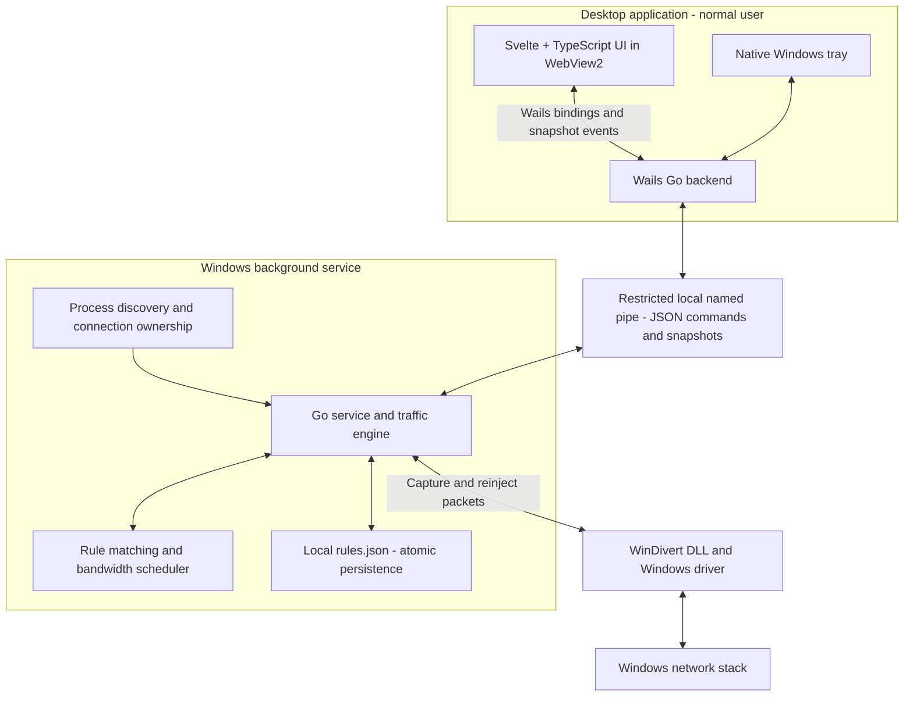

# SpeedLimitFree

[](https://github.com/gusdeyw/speedlimitfree/actions/workflows/release.yml)
[](https://github.com/gusdeyw/speedlimitfree/actions/workflows/tests.yml)
[](https://github.com/gusdeyw/speedlimitfree/releases/latest)
[](#architecture)
[](#built-with-ai-assistance)

**[Download Windows installer (.exe)](https://github.com/gusdeyw/speedlimitfree/releases/latest/download/SpeedLimitFree-Setup.exe)** · [Download ZIP](https://github.com/gusdeyw/speedlimitfree/releases/latest/download/SpeedLimitFree-windows-x64.zip) · [Release notes](https://github.com/gusdeyw/speedlimitfree/releases/latest)

Windows 11 x64. Choose the installer for normal use. The ZIP includes the same app and requires service setup. [Checksums](https://github.com/gusdeyw/speedlimitfree/releases/latest/download/SHA256SUMS.txt) are included with each release.

A Windows bandwidth-control utility built with **Go, Wails, Svelte, TypeScript, and plain CSS**.

Created by [gusdeyw](https://github.com/gusdeyw), with AI assistance during development.

The desktop lists real processes, displays attributed traffic rates, and manages independent download/upload rules. A separate Go service owns traffic interception and keeps rules active after the UI exits.

The desktop uses a compact application table with inline download/upload editing and expandable process rows. Light and dark appearance follow the Windows app theme automatically, including changes while the window is open. Icons come from local application executables; bounded memory caches avoid repeated extraction, and no process icon files are saved. Inaccessible executables use a generic icon. Applications sharing a host executable may also share its icon.

**Current status:** desktop, tray, service controls, and local repair/startup are implemented and tested. The installed traffic engine starts successfully. Throughput accuracy, VPN behavior, and clean-machine installation still require validation. Do not treat this build as a qualified production network driver application.

## Built with AI assistance

SpeedLimitFree was built with the help of AI to reduce development time and keep the focus on the core problem: controlling how much bandwidth individual applications can use. AI assisted with planning, implementation, testing, and documentation, while [gusdeyw](https://github.com/gusdeyw) directed the product requirements and design decisions.

AI is part of the development process. The app's bandwidth control runs locally through Go and Windows APIs and does not require an AI model or an AI service at runtime.

## Architecture

The desktop handles interaction, while a separate Windows service owns the rules and traffic engine. This separation lets limits remain active after you quit the desktop and keeps packet processing out of the frontend.



| Component | Responsibility | Source |
| --- | --- | --- |
| Svelte frontend | Search processes, edit upload/download limits, and display service snapshots using the system theme. | [`frontend/src`](frontend/src) |
| Wails desktop backend | Bridge UI commands to the service, manage the tray, and extract executable icons into a bounded memory cache. | [`internal/desktop`](internal/desktop), [`internal/tray`](internal/tray), [`internal/appicons`](internal/appicons) |
| Windows service and IPC | Run independently of the desktop and handle requests over a named pipe restricted to the configured owner, administrators, and SYSTEM. | [`cmd/service`](cmd/service), [`internal/ipc`](internal/ipc) |
| Traffic engine | Attribute packets to processes, match application or process rules, schedule traffic with separate directional budgets, and reinject packets through WinDivert. | [`internal/engine`](internal/engine), [`internal/attribution`](internal/attribution), [`internal/rules`](internal/rules), [`internal/shaping`](internal/shaping), [`internal/traffic`](internal/traffic) |
| Persistence and installation | Save application rules atomically; install, repair, and remove the app and service through NSIS and PowerShell helpers. | [`internal/storage`](internal/storage), [`build/windows/installer`](build/windows/installer), [`scripts`](scripts) |

When you change a limit, the UI calls the Go backend through Wails. The backend sends a command to the service, which validates the rule, saves persistent application rules, and updates the scheduler. Captured packets are matched to their owning process and rule; limited traffic waits for its directional budget before being reinjected. Traffic with uncertain ownership passes through.

An application rule shares one bandwidth budget across its matching processes and connections. Process overrides are temporary and are not restored from disk. Snapshots return to the visible desktop for display; hiding to the tray suspends periodic UI updates while the service continues working.

Installed application rules and service logs live in `%PROGRAMDATA%\SpeedLimitFree`; the desktop's WebView2 data lives in `%LOCALAPPDATA%\SpeedLimitFree\WebView2`. Service installation and Start/Stop/Restart actions use an elevated helper after the Windows administrator prompt. Normal UI use does not require elevation.

## Open the built application

For downloads, use the **Windows installer** link above. Successful builds on `main` publish updated EXE and ZIP assets automatically; see [release workflow details](docs/RELEASING.md).

Run **`SpeedLimitFree-Setup.exe`** from the latest release for the normal Windows installation. Local builds produce `build/bin/SpeedLimitFree-<version>-Setup.exe`. Setup requests administrator access once, installs the app and automatic background service, adds a Start menu shortcut and a Windows Installed Apps entry, and offers optional startup in the tray. The desktop launches through Explorer with normal user privileges. The Microsoft WebView2 bootstrapper runs only if the runtime is missing; that step requires internet access.

Run the same or a newer installer to update or repair. Setup closes existing SpeedLimitFree tray windows, stages the full payload, preserves rules, and rolls files/service configuration back if the update fails. Older installers are rejected. Silent setup supports `/S` and optional `/TRAY=0` or `/TRAY=1`; without an override, upgrades retain the previous tray-startup choice.

The ZIP remains available: extract it completely and run `build/bin/SpeedLimitFree.exe` (or `SpeedLimitFree.exe` in the extracted release folder).

Open **Settings → Install / repair** and complete the Windows administrator prompt. The installer copies the application and driver into `C:\Program Files\SpeedLimitFree`, registers an automatic Windows service, and creates a Start menu shortcut. Settings live in `C:\ProgramData\SpeedLimitFree`.

The desktop itself runs without administrator privileges. Until the service connects, it displays real accessible process identities and explicitly unavailable traffic measurements. It never substitutes sample traffic.

Closing **X** hides the desktop to the Windows system tray. Click the speedometer icon to restore it; right-click for **Open**, **Pause/Resume limits**, and **Quit SpeedLimitFree**. Windows may initially put the icon inside the **^** overflow beside the clock. Launching the executable again restores the existing window.

**Quit SpeedLimitFree** exits the UI and removes the tray icon. The separate service continues enforcing rules. Hidden UI statistics are suspended; the WebView stays in memory until Quit.

If updating an older installation, the new `build/bin/SpeedLimitFree.exe` can use the already-running service immediately. Use **Install / repair** from the updated package to replace the installed Start menu copy as well.

In **Settings**, **Start**, **Stop**, and **Restart** control the Windows service separately from pausing limits. Stop keeps saved rules and disables enforcement. The app shows the actual Windows service state, the traffic engine state, and recent service/setup logs. Actions remain busy until the elevated helper finishes; cancellation and failures are shown in the app.

**Install / repair** validates and stages the service files before stopping it. Identical service files and configuration leave a running service uninterrupted. Failed replacements or startup trigger restoration of the previous files/configuration and restart a previously running service. A locked desktop executable produces an update warning after the service is running. Quit the old desktop from its tray before updating that executable. Saved rules are retained.

For service controls from a terminal, use `limiter-debug.exe --service-state` or `limiter-debug.exe --service-action start` (also `stop`, `restart`, and `install`). Management requests open the Windows administrator prompt and wait for the result.

After setup:

1. Find an application in **Applications**, using its name, path, or PID. Ctrl+K focuses search.
2. Click its **Download limit** or **Upload limit**, choose a value/unit, and click **Apply**. **Set unlimited** clears that direction.
3. Expand the application to edit a temporary limit for one running process. A new override keeps the other direction from the application rule.
4. Review rules in **Saved limits**, including applications that have exited. Double-click a row to show its path and enable, edit, or remove its rule. **Add application** chooses an executable that need not be running.

An application rule shares one budget across matching processes and connections. A process override takes precedence for that process and expires when it exits. Executable paths identify applications; helper executables need their own rules.

## Development

Requirements: Windows 11 x64, Go 1.25+, Node.js compatible with Vite 8 (the build was tested with Node 24.15), and the Microsoft WebView2 runtime.

```powershell
go install github.com/wailsapp/wails/v2/cmd/wails@v2.15.0
cd frontend
npm ci
cd ..
wails dev
```

If Go or Wails is not on PATH, add the Go installation's `bin` directory and `(go env GOPATH)\bin` to the current shell's PATH. `scripts/build.ps1` also detects the existing `D:\Go\bin` installation on the development machine.

Build the frontend, test the Go code, compile the executables, and assemble the driver files:

```powershell
.\scripts\build.ps1
```

The build also produces the NSIS setup executable. Its compiler is downloaded into `.tools` at pinned version 3.12 and verified by SHA-256; the bundled Microsoft WebView2 bootstrapper is checked for a valid Microsoft signature. Use `-SkipInstaller` for a desktop/service-only build, or run `scripts/build-installer.ps1` to package already-built payload files. See [installer design and validation](docs/INSTALLER.md).

WinDivert is downloaded from its official pinned release, checked against the recorded archive SHA-256, and bundled with its upstream license. Downloading/building does not install or start the driver. See [third-party notices](THIRD_PARTY_NOTICES.md).

For frontend-only development, use `npm run dev` inside `frontend`. A standalone browser shows the disconnected state because the Wails bridge is absent.

## Process-only service mode

This mode tests the real service boundary, process discovery, and persistence without administrator privileges or packet interception:

```powershell
.\build\bin\SpeedLimitFree-service.exe --monitor-only --data "$env:LOCALAPPDATA\SpeedLimitFree-dev"
```

Keep that console running and open the desktop executable. Traffic rates stay unavailable and saved rules remain pending. Stop the console service with Ctrl+C before installing or starting the system service; both use the same named pipe.

## Traffic prototype

List process IDs:

```powershell
.\build\bin\limiter-debug.exe --list
```

In an elevated terminal, while the main traffic service is stopped, limit a chosen test process:

```powershell
.\build\bin\limiter-debug.exe --pid 1234 --download 5000000 --upload 500000 --driver .\build\bin
```

Replace `1234` with the intended test process. Rates are bytes per second; omitted directions are unlimited. Ctrl+C stops the prototype. Its temporary rule does not persist.

Query a running service:

```powershell
.\build\bin\limiter-debug.exe --status
```

## Verification

Run the hosted suite from **[Actions → Tests → Run workflow](https://github.com/gusdeyw/speedlimitfree/actions/workflows/tests.yml)**. It checks the frontend, Go code, browser behavior, service setup, and compiled installer fixtures without publishing a release. Browser reports are downloadable from the run's artifacts. Development branch pushes and pull requests run Tests automatically; `main` runs the checks through the release workflow.

```powershell
# Build the embedded frontend before testing the root Go package.
cd frontend
npm run build
npx playwright install chromium
npm test
cd ..
go test ./...
go vet ./...
.\scripts\test-service-setup.ps1
```

`scripts/test-native.ps1` runs a Wails/WebView2 smoke test against a temporary process-only service on an isolated named pipe. It leaves any installed service running. It uses a test-only local copy of Wails to enable a local DevTools connection because Wails clears external debugging arguments. It does not modify the Go module cache or the release executable. The script checks native tray registration, close/hide, restore, pause/resume, single-instance reopening, explicit quit, and service independence, then closes its test processes.

Browser test data is confined to `frontend/tests`; it is not bundled into the application. Screenshots from those tests use synthetic process fixtures. See [validation results and remaining checks](docs/VALIDATION.md).

## Technical limits

- Windows 11 x64 is the initial target; other operating systems require different packet backends.
- Local download shaping controls delivery after traffic reaches the PC. It cannot strictly cap physical inbound link usage, especially for unresponsive UDP senders.
- Packet accounting includes IP/transport headers and retransmissions. Summary rates include attributed traffic; unknown traffic is reported separately in diagnostics.
- Ambiguous process ownership, unsupported packets, and loopback traffic pass through. Scoped IPv6/link-local attribution is not qualified.
- Queue caps are 32 MiB total, 2 MiB per rule/direction, and 128 KiB per flow. Packets waiting two seconds expire. Very low limits can stall applications; startup burst and packet granularity affect short observations.
- Closing the service's driver handles should restore ordinary forwarding; queued packets may be lost. Abrupt failure recovery needs elevated testing.
- A disabled process override falls back to an enabled application rule. Both directions set to Unlimited can be used as an explicit process exception.

## Uninstall completely

Use **Windows Settings → Apps → Installed apps → SpeedLimitFree → Uninstall**, or run the installed `Uninstall.exe`. Uninstall permanently removes saved rules, settings, logs, setup backups/results, app files, shortcuts, startup entries, app-owned WebView caches, and the service/Installed Apps registrations. There is no keep-settings option. Windows' shared WebView2 runtime remains installed.

From an administrator PowerShell terminal:

```powershell
& 'C:\Program Files\SpeedLimitFree\uninstall-service.ps1'
```

The command-line script follows the same full-removal policy. It removes this installation's WinDivert registration only after checking for other clients; a driver belonging to another application is left alone. If another app is using our driver copy or a file is locked, uninstall reports failure and keeps a retryable uninstaller. Downloaded installers/ZIPs, source checkouts, and Windows-maintained installation history are outside the installed application's cleanup scope.

## Structure

- `main.go`, `internal/desktop`: Wails shell and bindings.
- `internal/tray`: native Windows notification icon and context menu.
- `frontend/src`: Svelte table, inline limit editor, application/process grouping, and service settings.
- `internal/appicons`: Windows executable icon extraction and bounded memory cache.
- `cmd/service`, `internal/ipc`: Windows service and restricted local named pipe.
- `internal/traffic`, `internal/attribution`: WinDivert integration and process ownership.
- `internal/shaping`, `internal/rules`, `internal/storage`: scheduling, policies, and atomic persistence.
- `cmd/limiter-debug`: standalone process limiter and service diagnostics.

See [PLAN.md](PLAN.md) for the architecture and delivery sequence.
